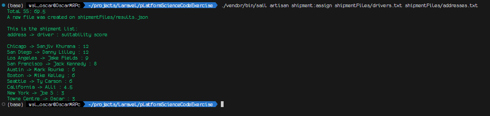
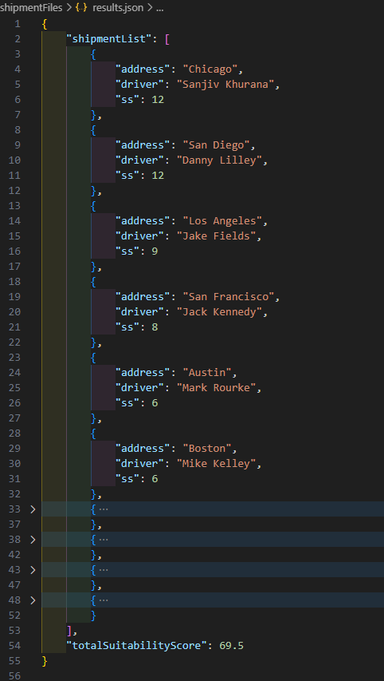
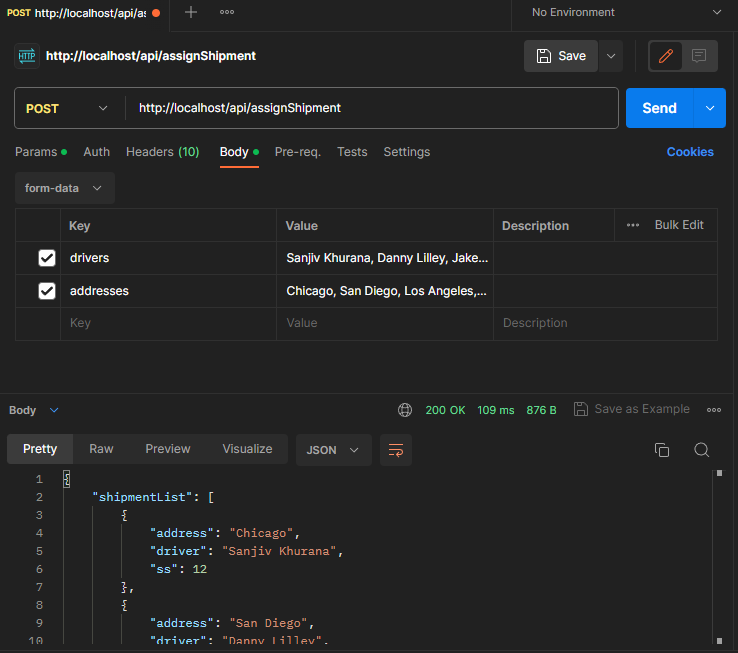

# SDE Code Exercise

## Platform Science Code Exercise

Our sales team has just struck a deal with Acme Inc to become the exclusive provider for routing their product shipments via 3rd party trucking
fleets. The catch is that we can only route one shipment to one driver per day.

Each day we get the list of shipment destinations that are available for us to offer to drivers in our network. Fortunately our team of highly trained
data scientists have developed a mathematical model for determining which drivers are best suited to deliver each shipment.

With that hard work done, now all we have to do is implement a program that assigns each shipment destination to a given driver while
maximizing the total suitability of all shipments to all drivers.

The top-secret algorithm is:

-   If the length of the shipment's destination street name is even, the base suitability score (SS) is the number of vowels in the driver’s
name multiplied by 1.5.
-   If the length of the shipment's destination street name is odd, the base SS is the number of consonants in the driver’s name multiplied by
1.
-   If the length of the shipment's destination street name shares any common factors (besides 1) with the length of the driver’s name, the
SS is increased by 50% above the base SS.


Write an application in the language of your choice that assigns shipment destinations to drivers in a way that maximizes the total SS over the set
of drivers. Each driver can only have one shipment and each shipment can only be offered to one driver. Your program should run on the
command line and take as input two newline separated files, the first containing the street addresses of the shipment destinations and the second
containing the names of the drivers. The output should be the total SS and a matching between shipment destinations and drivers. You do not
need to worry about malformed input, but you should certainly handle both upper and lower case names.


## Files created for this Excercise

-   app/Http/Controllers/ShipmentController.php
-   app/Console/Commands/AssignShipment.php


## How to run on Docker

Create a docker container with:

```
 ./vendor/bin/sail up 
```


## How to run on terminal

With a docker container running this project:

```
./vendor/bin/sail artisan shipment:assign shipmentFiles/drivers.txt shipmentFiles/addresses.txt
```





## How to run over an HTTP API

First create a server running the next command:
```
 ./vendor/bin/sail artisan serve 
```

Then make a POST request to http://localhost/api/assignShipment, you must send drivers and addresses, bot should be a comma separated list of names/drivers, example:

```
curl --location 'http://localhost/api/assignShipment' \
--header 'Accept: application/json' \
--form 'drivers="Sanjiv Khurana, Danny Lilley, Jake Fields, Jack Kennedy, Mark Rourke, Mike Kelley, Ty Carson, Alli, Joe S, Oscar"' \
--form 'addresses="Chicago, San Diego, Los Angeles, San Francisco, Austin, Boston, Seattle, California, New York, Towne Centre"'
```


